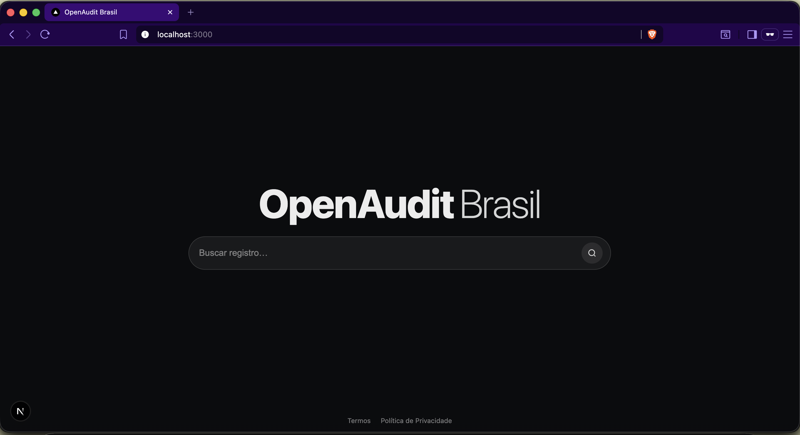

# OpenAudit Brasil — UI (MVP)

Interface minimalista estilo "busca", construída em **Next.js (App Router)**, com tema **dark fosco** e fluxo de pesquisa simulado para o MVP.

> **Status:** MVP de interface (sem backend).  
> **Objetivo do MVP:** validar identidade visual + comportamento de busca + espaço para futura integração com fontes públicas.




---

## Sumário

- [Visão geral](#visão-geral)
- [Requisitos do MVP](#requisitos-do-mvp)
- [Como rodar localmente](#como-rodar-localmente)
- [Estrutura do projeto](#estrutura-do-projeto)
- [Comportamento da interface](#comportamento-da-interface)
- [Acessibilidade (a11y)](#acessibilidade-a11y)
- [Configuração e personalização](#configuração-e-personalização)
- [Roadmap](#roadmap)
- [Boas práticas e limites do projeto](#boas-práticas-e-limites-do-projeto)
- [Contribuindo](#contribuindo)
- [Licença](#licença)
- [Contato](#contato)

---

## Visão geral

Este projeto entrega uma home com visual minimalista:

- Fundo **preto fosco**
- Fonte **branca**
- Logo central: **OpenAudit** (bold) + **Brasil** (thin)
- Barra de pesquisa com ícone
- Pesquisa ao apertar **Enter** ou clicar no **ícone**
- Ao pesquisar: barra "sobe", exibe loading **"Pesquisando..."** com animação de **três pontinhos**
- Abaixo do loading: exibe **fontes de dados** (uma por vez, 5s cada)
- Ao final do ciclo: oculta o loading e exibe uma mensagem de "página em desenvolvimento"

Este MVP **não consulta dados reais**. Ele simula o fluxo para manter o front-end pronto para integração.

---

## Requisitos do MVP

### Requisitos funcionais

1. **Home minimalista**
   - Logo central e barra de pesquisa no centro da tela.
2. **Ação de busca**
   - Iniciar busca ao:
     - apertar **Enter** no input
     - clicar no **ícone** da barra
3. **Transição para estado de busca**
   - A barra de pesquisa deve ir para o topo (layout "modo resultados").
4. **Loading**
   - Exibir `Pesquisando...` com animação somente nos `...` (1,2,3 e reinicia).
5. **Fontes exibidas no MVP**
   - Exibir uma por vez, **5 segundos** cada:
     - Receita Federal
     - gov.br
     - IBGE
     - IPEA
     - TSE
6. **Fim do loop**
   - Após exibir todas as fontes, ocultar loading e exibir:
     - `página em desenvolvimento. Apoie a causa comunidade@openauditbrasil.com`
7. **Rodapé**
   - Links: `Termos` e `Política de Privacidade`

### Requisitos não-funcionais

- **Next.js mais recente** (App Router).
- UI **responsiva** (desktop/mobile).
- Sem bibliotecas de UI no MVP (CSS simples).
- Interface minimalista e de fácil manutenção.

---

## Como rodar localmente

### Pré-requisitos

- Node.js 18+ (recomendado 20+)
- npm (ou pnpm/yarn/bun — ajuste os comandos conforme seu gerenciador)

### Instalação

```bash
npm install
````

### Executar em modo desenvolvimento

```bash
npm run dev
```

Acesse:

* [http://localhost:3000](http://localhost:3000)

### Build e produção

```bash
npm run build
npm run start
```

---

## Estrutura do projeto

Principais arquivos/pastas:

```
app/
  layout.tsx        # Layout raiz
  page.tsx          # Home + estados: idle/searching/done (MVP)
  globals.css       # Tema escuro fosco + layout minimalista
  terms/page.tsx    # Página de Termos (placeholder)
  privacy/page.tsx  # Página de Privacidade (placeholder)
public/
  ...               # Assets estáticos (futuro: logo, ícones, etc.)
```

---

## Comportamento da interface

### Estados

O MVP opera em 3 estados:

* `idle`: tela inicial
* `searching`: mostra loading e fontes rotativas
* `done`: mostra mensagem final (resultado placeholder)

### Fluxo detalhado

1. Usuário entra na home (`idle`)
2. Digita algo (ou não, conforme regra atual do MVP)
3. Pressiona Enter ou clica no ícone
4. UI muda para `searching`
5. Exibe:

   * `Pesquisando.` / `Pesquisando..` / `Pesquisando...` (loop)
   * uma fonte por vez (5s cada)
6. Após listar todas as fontes:

   * muda para `done`
   * exibe mensagem final de desenvolvimento

---

## Acessibilidade (a11y)

Este MVP já considera:

* Input com `aria-label`
* Rodapé com label de navegação
* Área de status com `aria-live="polite"` para anunciar mudanças ("Pesquisando…", resultado final)

Implementação futura:

* definir foco ao entrar em `searching` (ex.: manter foco no input para permitir editar rapidamente).
* adicionar "Voltar/Resetar busca" com role de botão e foco previsível.

---

## Configuração e personalização

### Alterar fontes exibidas

Em `app/page.tsx`:

```ts
const SOURCES = ["Receita Federal", "gov.br", "IBGE", "IPEA", "TSE"] as const;
```

### Alterar tempo de rotação (3s)

Em `app/page.tsx`:

```ts

({}, 1000);

```

### Alterar mensagem final

Em `app/page.tsx`, no estado `done`:

```tsx
<p>página em desenvolvimento. Apoie a causa comunidade@openauditbrasil.com</p>
```

### Ajustar visual (dark fosco)

Em `app/globals.css`:

* `--bg` controla o preto fosco
* `--fg` controla a cor do texto
* `--surface` e `--border` controlam o visual da barra

---

## Roadmap

### Curto prazo (UI)

* [ ] Bloquear busca vazia (ou decidir regra)
* [ ] Botão "Resetar" (voltar ao estado `idle`)
* [ ] Tela de "resultados" (lista minimalista estilo motor de busca)
* [ ] Melhorar páginas de Termos/Privacidade (texto real)

### Médio prazo (Integração)

* [ ] Criar endpoint `/api/search` (mock)
* [ ] Implementar polling/stream para mostrar fontes "em tempo real"
* [ ] Integrar com pipelines (crawler/indexação) conforme governança e compliance

### Longo prazo (Produto)

* [ ] Versão "local-first" (rodar local para reduzir risco)
* [ ] Auditoria de rastreabilidade (logs, versionamento, explicabilidade)
* [ ] Módulo de "metodologia" e "limites do sistema"

---

## Boas práticas e limites do projeto

Este repositório **não tem como objetivo "acusar" ninguém**.

Diretrizes essenciais (para reduzir risco e manter credibilidade):

* Tratar resultados como:

  * **anomalia estatística**
  * **padrão atípico**
  * **inconsistência estrutural**
  * **divergência documental**
* Nunca publicar inferência como "culpa".
* Separar:

  * **análise automatizada** (sinal)
  * **investigação manual** (conclusão/checagem)
* Respeitar termos de uso e LGPD:

  * dado "público" ≠ "livre para qualquer uso"
  * rastreabilidade e finalidade importam
* Transparência metodológica:

  * registrar fonte, data, versão do dado, transformação aplicada

> Este MVP é apenas UI. As decisões jurídicas/operacionais entram quando houver integração real com fontes.

---

## Contribuindo

Contribuições são bem-vindas, mas mantenha o projeto simples e defensável.

### Regras básicas

1. Abra uma Issue descrevendo problema/feature
2. Faça um fork e crie uma branch:

   * `feat/nome`
   * `fix/nome`
3. Faça PR com:

   * descrição do que mudou
   * screenshots (se mudar UI)
   * checklist de a11y básico

### Padrões sugeridos

* Commits: `feat:`, `fix:`, `chore:`, `docs:`
* Código: TypeScript estrito e legível
* Sem dependências desnecessárias

---

## Licença

Apache License 2.0

---

## Contato

* Email: **[comunidade@openauditbrasil.com](mailto:comunidade@openauditbrasil.com)**
* Organização: OpenAudit Brasil (GitHub)

